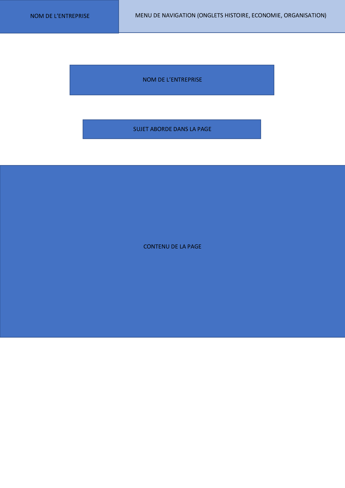
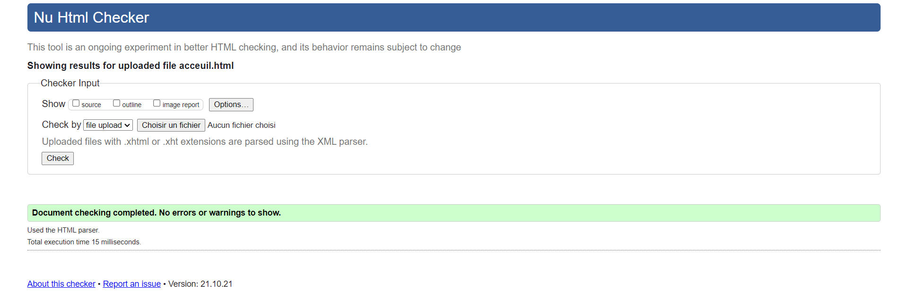
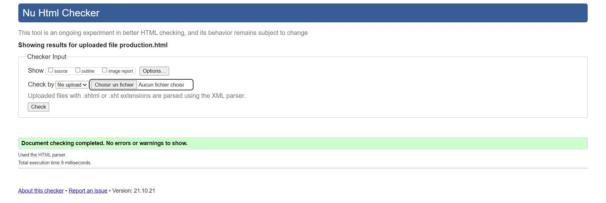
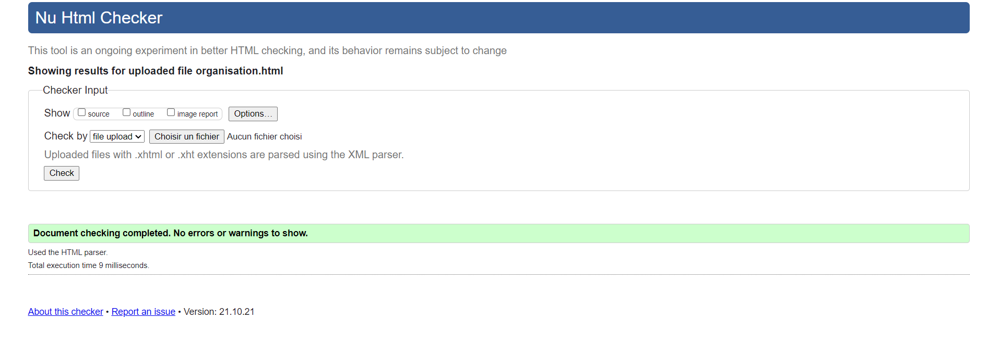
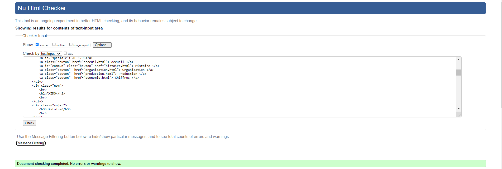

# Axido
Projet d'étude de l'entreprise Axido

# Livrable parties Économie et Documents numérique
[Rapport
](doc/GUILLOU_SAE106_S1B1_Axido.pdf)

Groupe : 
Aurélien GUILLOU ( référent )
Alexis SELY
Thomas GIRAUD
Antoine LACHAT

[GUILLOU_Aurélien](mailto:aurelien.guillou@edu.univ-fcomte.fr?subject=[SAE1.06]) 

Notre projet de SAE 1.06 consiste en l'étude d'une entreprise française d'au moins 15 personnes d'un point de vue organisationnel et économique. Nous avons donc choisis d'étudier l'entreprise Axido, qui nous semblait intéressant.

ecran de zoning : 

Nous avons designé notre écran de zoning de cette manière car nous avons decidé pour notre site web d'adopté une esthétique similaire a celle du site web de l'entreprise Axido.
L'ecran de zoning a été réalisé par aurélien GUILLOU.

ecran de prototypage : 

Nous avons choisie ces couleurs car ce sont celle utilisé sur le site de l'entreprise axido, et nous avons pensé que cela serait un choix pertinent d'utiliser les mêmes couleurs.
L'ecran prototype a été réalisé par aurélien GUILLOU et alexis SELY.

La recherche des différentes informations concernant l'entreprise a été réalisé par l'ensemble du groupe.
Le rapport a été rédigé par l'ensemble du groupe, chacun ayant écrit au moins une page du rapport : thomas GIRAUD a écrit la présentation général et le résumé de l'entreprise, alexis SELY a écrit l'historique de l'entreprise, antoine LACHAT a écrit la production de l'entreprise, aurélien GUILLOU à écrit l'organisation de l'entreprise et les chiffres de l'entreprise. 
La mise en page du rapport a été réalisé par aurélien GUILLOU et antoine LACHAT.

La page d'accueil a été codé par l'ensemble des membres du groupe.

La page concernant les chiffres de l'entreprise a été codé par thomas GIRAUD.

La page concernant la production de l'entreprise a été codé par antoine LACHAT

La page concernant l'organisation de l'entreprise a été codé par aurélien GUILLOU

La page concernant l'histoire de l'entreprise a été codé par alexis SELY

Ces différentes images correspondent aux différentes pages du site web passé au validator. 
